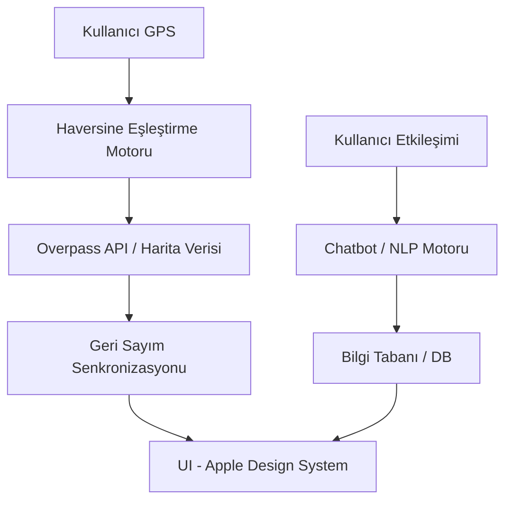

# 🚦 Sinyalizasyon — Akıllı Trafik Asistanı


> **"Trafik ışığında beklemeyi bir fırsata dönüştür."**

Sinyalizasyon, sürücülerin kırmızı ışıkta beklerken yaşadığı belirsizlik ve stresi ortadan kaldıran, bekleme süresini eğlenceli ve verimli bir deneyime dönüştüren Apple tasarım diline sahip modern bir web uygulamasıdır.

---

## ✨ Özellikler

- **⏱️ Gerçek Zamanlı Trafik Senkronizasyonu:** GPS verinizi kullanarak en yakın trafik ışığıyla eşleşir ve yeşil ışığa kalan süreyi anlık olarak gösterir.
- **🎮 İnteraktif Oyunlar:** Bekleme süresince oynayabileceğiniz Hafıza Oyunu (Memory), Refleks Testi ve Kelime Bulmaca (Wordle-style) gibi eğlenceli aktiviteler.
- **🧠 Bilgi Kartları:** Genel kültürden teknolojiye, doğadan bilime kadar ilginç bilgilerin yer aldığı dinamik kartlar.
- **🐱 Sinyal Akıllı Asistan:** Trafik kuralları, uygulama kullanımı ve sürüş ipuçları hakkında sorularınızı yanıtlayan entegre asistan.
- **📞 Hızlı Erişim & Mesajlar:** Acil durum numaralarına tek dokunuşla arama ve önceden hazırlanmış şablonlarla hızlı mesaj gönderimi.
- **📱 Apple Tasarım Dili:** iOS estetiğine uygun, kullanıcı dostu, premium ve akıcı arayüz.

---

## 🛠️ Teknoloji Yığını

### Frontend
- **HTML5 & CSS3:** Modern, responsive ve Apple tarzı cam efekti (glassmorphism) tasarımı.
- **Vanilla JavaScript:** Hızlı, hafif ve bağımsız mantık katmanı.
- **i18next-like Translation:** Dinamik Türkçe ve İngilizce dil desteği.

### Backend
- **Node.js & Express.js:** Güçlü ve ölçeklenebilir API mimarisi.
- **PostgreSQL:** Kullanıcı skorları, bilgi tabanı ve içerik yönetimi.
- **Overpass API (OSM):** Gerçek zamanlı coğrafi veri ve trafik ışığı düğüm analizi.

---

## 🚀 Hızlı Başlangıç

### Gereksinimler
- Node.js (v18+)
- PostgreSQL

### Kurulum

1. **Repoyu Klonlayın:**
   ```bash
   git clone https://github.com/umitcancinar/Sinyalizasyon.git
   cd Sinyalizasyon
   ```

2. **Backend Kurulumu:**
   ```bash
   cd backend
   npm install
   ```

3. **Veritabanı Yapılandırması:**
   `.env` dosyasını oluşturun ve veritabanı bağlantı bilgilerinizi ekleyin (Şifrelerinizi güvenli tutun!).

4. **Sistemi Başlatın:**
   ```bash
   # Backend için
   npm start
   
   # Frontend için
   # Herhangi bir HTTP server ile kök dizini (index.html) servis edin.
   ```

---

## 🏗️ Proje Mimarisi



---

## 🛡️ Güvenlik ve Kararlılık

- **Simülasyon Modu:** Geliştirme ve test süreçleri için gerçek GPS verisine ihtiyaç duymayan özel simülasyon desteği.
- **Rate Limiting:** API uç noktalarını korumak için entegre hız sınırlayıcı.
- **CORS & Güvenlik Başlıkları:** Güvenli veri iletişimi için optimize edilmiş vercel.json ve middleware yapılandırması.

---

## 👤 Hazırlayan

**Ümitcan Çınar**  
*Full Stack Developer & AI Integration Enthusiast*

---

> **Not:** Bu proje eğitim amaçlı geliştirilmiş olup, trafikte kullanımı sırasında dikkat dağıtmaması için sesli uyarı sistemleriyle desteklenmiştir. Lütfen sürüş sırasında telefon kullanım kurallarına uyunuz.
